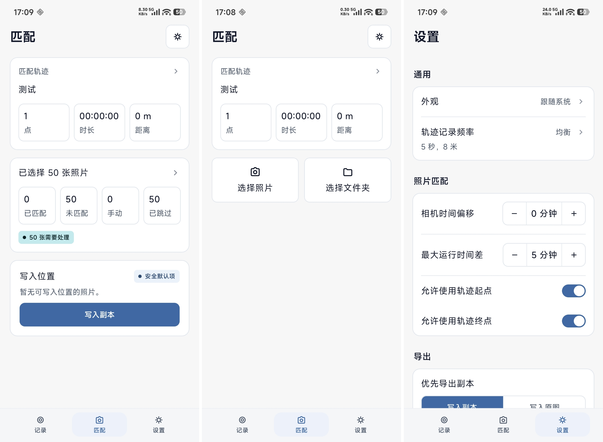

# TrackWrite

TrackWrite 用于在拍摄时记录 GPS 轨迹，并在拍摄后把照片按时间匹配到轨迹点，写入可靠的地理位置元数据。


## 主要功能

- GPS 轨迹记录：通过前台定位服务记录轨迹，支持开始、暂停、恢复和停止。
- 记录状态可见：展示记录状态、点数、时长、距离、最近轨迹点和异常提示。
- 轨迹管理：保存历史轨迹，支持选择、重命名、删除、GPX 导入和 GPX 导出。
- 照片匹配：读取照片 EXIF 拍摄时间，按轨迹点精确匹配或区间插值匹配位置。
- 匹配规则设置：支持相机时间偏移、最大时间差、起点/终点兜底匹配和记录频率配置。
- 手动补点：可用高德地图搜索或点选位置，为未匹配照片手动设置位置。
- EXIF 写入：支持导出带 GPS 的照片副本，也支持直接写入原图。
- 批量结果反馈：写入过程中显示进度，并汇总写入、跳过、失败项目。


当前 Android 配置：

- `minSdk`: 31
- `targetSdk`: 34
- `compileSdk`: 34
- Gradle wrapper: 8.12

## 项目结构

```text
.
├── app/                         # Android 应用模块
│   └── src/main/java/com/trackwrite/app
│       ├── data/                # Room 数据库与轨迹仓库
│       ├── domain/              # 轨迹、匹配、GPX 和统计等领域逻辑
│       ├── io/                  # GPX 文件导入导出
│       ├── map/                 # 手动定位和高德地图 WebView 集成
│       ├── media/               # 照片读取、匹配和 EXIF 写入
│       ├── recording/           # 前台 GPS 记录服务与记录状态
│       ├── settings/            # 应用设置
│       └── ui/                  # 主题
├── docs/                        # 第三方文档和项目补充资料
├── scripts/                     # 构建脚本
├── PRODUCT.md                   # 产品定位和设计原则
└── DESIGN.md                    # 视觉与交互设计方向
```

## 本地配置

在根目录创建或更新 `local.properties`，按需要加入以下配置：

```properties
TRACKWRITE_AMAP_API_KEY=your_amap_android_key
TRACKWRITE_AMAP_WEB_KEY=your_amap_web_key
TRACKWRITE_AMAP_SECURITY_JS_CODE=your_amap_security_js_code
```

发布构建还需要配置签名信息：

```properties
TRACKWRITE_RELEASE_STORE_FILE=/absolute/path/to/trackwrite-release.jks
TRACKWRITE_RELEASE_STORE_PASSWORD=...
TRACKWRITE_RELEASE_KEY_ALIAS=...
TRACKWRITE_RELEASE_KEY_PASSWORD=...
```

## 常用命令

```bash
# 运行单元测试
./gradlew test

# 构建调试包
./gradlew :app:assembleDebug

# 构建发布包，需要先配置 release signing
./gradlew :app:assembleRelease

# 使用项目脚本构建指定版本
scripts/build-apk.sh v2.1 --code 21

# 上传已构建 APK 到 GitHub Release，并用版本名创建 release tag
scripts/release-apk.sh v2.1 --code 21
```
